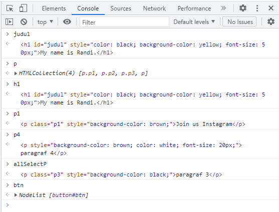
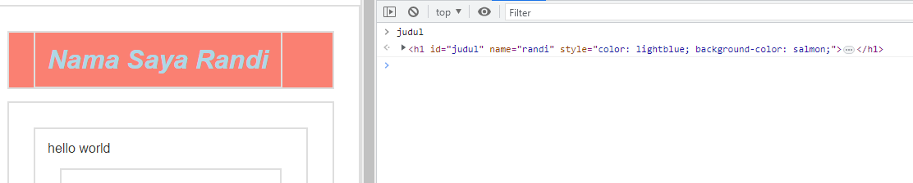

# JavaScript DOM
“DOM or Document Object Model is a special JavaScript object that exists only in the Browser environment. This object is used to get the website document structure, even manipulate it.”

## Syntax DOM Javascript

### Selecting elements
```javascript
// Selecting Elements:

// document.getElemenById()
const judul = document.getElementById('judul');
judul.style.color = 'black';
judul.style.backgroundColor = 'yellow';
judul.innerHTML = 'My name is Randi.';

// document.getElementsByTagName()
const p = document.getElementsByTagName('p');

for (let i = 0; i < p.length; i++) {
    p[i].style.backgroundColor = 'brown';   
}

// mengubah object menjadi element agar bisa di beri style
const h1 = document.getElementsByTagName('h1')[0];
h1.style.fontSize = '50px';

// document.getElementsByClassName()
const p1 = document.getElementsByClassName('p1')[0];
p1.innerHTML = 'Join us Instagram';

// document.querySelector() -> element
const p4 = document.querySelector('#b p');
p4.style.color = 'white';
p4.style.fontSize = '20px';

// document.querySelectorAll() -> element
const allSelectP = document.querySelectorAll('p')[2];
allSelectP.style.backgroundColor = 'black';

// document.getElementsByName()
const btn = document.getElementsByName('btn');
````
### Console Selecting Elements
;  


### Traversing elements
```javascript

// DOM Traversal
const close = document.querySelectorAll('.close');

close.forEach(function(el) {
    el.addEventListener('click', function(e) {
        e.target.parentElement.style.display = 'none';
    });
});

```

### Console Traversing
;

### Manipulating elements, Working with Attributes, Manipulating Element’s Styles
```javascript
// Manipulating elements  

// innerHTML
const judul = document.getElementById('judul');
judul.innerHTML = '<em>Nama Saya Randi</em>';

const sectionA = document.querySelector('#a');
sectionA.innerHTML = 'hello world';

// creatElement
let paragraphBaru = document.createElement('p');
let teksBaru = document.createTextNode('Paragraph Baru'); // createTextNode
// simpan tulisan dalam sebuah paragraph
paragraphBaru.appendChild(teksBaru);
// simpan pBaru di akhir section a
let bagianBaru = document.getElementById('a');
bagianBaru.appendChild(paragraphBaru); // appenChild

// Section 5. Working with Attributes

// element.setAttribute()
const judulAttribute = document.getElementsByTagName('h1')[0];
judul.setAttribute('name', 'randi');

// Section 6. Manipulating Element’s Styles

// element.style<property CSS>
const judulStyle = document.querySelector('#judul');
judulStyle.style.color = 'lightblue';
judulStyle.style.backgroundColor = 'salmon';

```

### Console Traversing
;  

### Working with Events & Scripting Web Forms
```javascript
function ubahWarnaP1 (){
    p1.style.background = 'blue';
}

const p1 = document.querySelector('.p1')
p1.onclick = ubahWarnaP1;

function ubahWarnaP2 (){
    p2.style.background = 'blue';
}

const p2 = document.querySelector('.p2')
p2.onclick = ubahWarnaP2;

function ubahWarnaP3 () {
    p3.style.background = 'blue';
}

const p3 = document.querySelector('.p3')
p3.onclick = ubahWarnaP3


// Menambah Element Baru
const p4 = document.querySelector('section#b p')
p4.addEventListener('click', function() {
    const ul = document.querySelector('section#b ul');
    const liBaru = document.createElement('li');
    const textLiBaru = document.createTextNode('Baris Baru')
    
    liBaru.appendChild(textLiBaru);
    ul.appendChild(liBaru);
})

const p3 = document.querySelector('.p3');
p3.onclick = function() {
    p3.style.background = 'lightblue';
}

p3.onclick = function() {
    p3.style.color = 'red';
}

const p3 = document.querySelector('.p3');
p3.addEventListener('mouseenter', function() {
    p3.style.backgroundColor = 'blue';
});

p3.addEventListener('mouseleave', function() {
    p3.style.backgroundColor = 'white';
});

p3.addEventListener('dblclick', function() {
    p3.style.color = 'red';
});
```

### Console Events & Scripting Web Forms
;